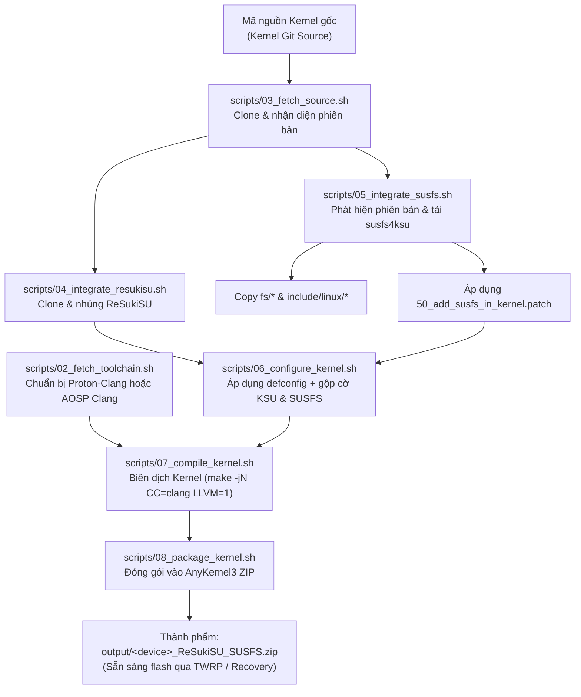

# 🚀 Android Kernel Auto-Builder với ReSukiSU & SUSFS

Hệ thống tự động hóa hoàn chỉnh để tải, tích hợp driver root **ReSukiSU** và cơ chế ẩn root siêu cấp **SUSFS (susfs4ksu)**, sau đó biên dịch kernel Android và đóng gói thành file flashable **AnyKernel3 ZIP** sẵn sàng nạp qua Custom Recovery (TWRP / OrangeFox) hoặc fastboot.

---

## 📌 Mục lục
- [Tổng quan & Tính năng](#-tổng-quan--tính-năng)
- [Cơ chế hoạt động](#-cơ-chế-hoạt-động)
- [Cấu trúc dự án](#-cấu-trúc-dự-án)
- [Hướng dẫn sử dụng](#-hướng-dẫn-sử-dụng)
  - [Cách 1: Chạy trên GitHub Actions (Khuyên dùng)](#cách-1-chạy-tự-động-trên-github-actions-cloud)
  - [Cách 2: Chạy trực tiếp trên Linux nội bộ](#cách-2-chạy-trên-linux-nội-bộ)
  - [Cách 3: Chạy qua môi trường Docker](#cách-3-chạy-qua-docker)
- [Bảng tương thích Kernel & Nhánh SUSFS](#-bảng-tương-thích-kernel--nhánh-susfs)
- [Giải thích cấu hình Kconfig](#-giải-thích-cấu-hình-kconfig)
- [Xử lý sự cố thường gặp (Troubleshooting)](#-xử-lý-sự-cố-thường-gặp)

---

## ✨ Tổng quan & Tính năng

- **Tự động tích hợp ReSukiSU**: Tải mã nguồn [ReSukiSU](https://github.com/ReSukiSU/ReSukiSU), thiết lập symlink `drivers/kernelsu`, chỉnh sửa `Makefile` và `Kconfig` tự động.
- **Tự động áp dụng SUSFS (susfs4ksu)**: Tự động phân tích phiên bản Kernel (4.9, 4.14, 4.19, 5.4, 5.10, 5.15, 6.1, 6.6), tải đúng nhánh patch từ [simonpunk/susfs4ksu](https://gitlab.com/simonpunk/susfs4ksu), sao chép thư viện `fs/` và `include/linux/`, áp dụng patch kernel và kích hoạt chế độ **SUSFS Inline Hook**.
- **Hỗ trợ đa dạng Toolchain**:
  - `proton-clang`: Tối ưu hóa cao, tích hợp sẵn binutils/sysroot, phù hợp với kernel Non-GKI (4.14, 4.19, 5.4).
  - `aosp-clang`: Clang chuẩn của Google AOSP (r416183b, r450784d, r487747c, r510928...), phù hợp cho GKI 2.0 (5.10, 5.15, 6.1+).
- **Hỗ trợ cả Non-GKI và GKI 2.0**: Hoạt động với cả cấu trúc repo truyền thống lẫn repo GKI của Google (`common/`).
- **Đóng gói AnyKernel3 tự động**: Tự động tải AnyKernel3, chèn file Image kernel, dtb, dtbo và tạo file ZIP có checksum SHA256.
- **Đa nền tảng thực thi**: Hỗ trợ chạy Cloud qua GitHub Actions, CLI Script Bash, Trình hướng dẫn tương tác bằng Python (`builder.py`), và Docker container.

---

## 🔄 Cơ chế hoạt động



---

## 📂 Cấu trúc dự án

```text
Kernel builder/
├── .github/
│   └── workflows/
│       └── build-kernel.yml            # CI/CD GitHub Actions với giao diện Web dispatch
├── config/
│   ├── config.env.example              # File cấu hình mẫu hoàn chỉnh
│   ├── devices/
│   │   ├── xiaomi_example.env          # Cấu hình mẫu Non-GKI (Xiaomi 4.19 - POCO F3)
│   │   └── gki_example.env             # Cấu hình mẫu GKI 2.0 (Google GKI 5.10 / 5.15)
│   └── kconfig/
│       ├── resukisu.config             # Các cờ Kconfig tối ưu cho ReSukiSU
│       └── susfs.config                # Các cờ Kconfig kích hoạt tính năng ẩn của SUSFS
├── scripts/
│   ├── 01_setup_env.sh                 # Cài đặt các gói phụ thuộc trên host
│   ├── 02_fetch_toolchain.sh           # Tải compiler Clang / GCC
│   ├── 03_fetch_source.sh              # Clone kernel source và đọc version
│   ├── 04_integrate_resukisu.sh        # Tích hợp driver ReSukiSU
│   ├── 05_integrate_susfs.sh           # Patch mã nguồn SUSFS và headers
│   ├── 06_configure_kernel.sh          # Tạo file .config và kích hoạt cờ KSU/SUSFS
│   ├── 07_compile_kernel.sh            # Chạy tiến trình build kernel đa luồng
│   └── 08_package_kernel.sh            # Đóng gói AnyKernel3 flashable zip
├── docker/
│   ├── Dockerfile                      # Container Ubuntu 22.04 đóng gói sẵn môi trường
│   └── docker-compose.yml
├── build.sh                            # Script điều phối chính (Master runner)
├── builder.py                          # Trình thuật sĩ CLI tương tác bằng tiếng Việt
├── run_docker.sh                       # Chạy build tự động trong Docker
└── README.md
```

---

## 🚀 Hướng dẫn sử dụng

### Cách 1: Chạy tự động trên GitHub Actions (Cloud)
*(Khuyên dùng nếu bạn không muốn tốn 20-40GB ổ cứng và CPU của máy tính)*

1. Đưa toàn bộ thư mục này lên GitHub (Push lên một repository cá nhân, có thể đặt Private).
2. Vào tab **Actions** trên GitHub repository.
3. Chọn workflow **"Build Android Kernel with ReSukiSU + SUSFS"**.
4. Nhấn **"Run workflow"** và điền các thông tin:
   - **Kernel Source Git Repository URL**: Link mã nguồn kernel của điện thoại.
   - **Kernel Source Branch**: Nhánh tương ứng (ví dụ: `lineage-20`, `android12-5.10`, `main`).
   - **Device Defconfig**: Tên file defconfig nằm trong `arch/arm64/configs/` (ví dụ: `vendor/kona-perf_defconfig`).
   - **Device Codename**: Mã máy (ví dụ: `alioth`, `sweet`, `vayu`).
   - **Toolchain**: Chọn `proton-clang` (cho 4.14/4.19/5.4) hoặc `aosp-clang` (cho 5.10+).
   - **ReSukiSU & SUSFS**: Đặt là `true`.
   - **Publish to GitHub Releases**: Đặt là `true` để tự động upload file ZIP lên tab Releases.
5. Chờ quá trình build hoàn tất (khoảng 8-20 phút tùy kernel), sau đó tải file ZIP tại tab **Releases** hoặc **Artifacts**.

---

### Cách 2: Chạy trên Linux nội bộ

#### Cách 2.1: Sử dụng Trình thuật sĩ tương tác (Wizard)
Chạy script Python để được hỏi từng bước:
```bash
python3 builder.py
```
Trình thuật sĩ sẽ hỏi bạn link source, defconfig, loại máy, tự động tạo file `config/config.env` và hỏi bạn có muốn tiến hành build luôn không.

#### Cách 2.2: Cấu hình thủ công qua file `config.env`
1. Sao chép file mẫu:
   ```bash
   cp config/config.env.example config/config.env
   ```
2. Mở file `config/config.env` bằng trình biên tập (nano, vim, gedit, vs code) và chỉnh sửa các tham số của máy bạn:
   ```bash
   DEVICE_NAME="tên_mã_máy"
   KERNEL_SOURCE="https://github.com/..."
   KERNEL_BRANCH="tên_nhánh"
   KERNEL_DEFCONFIG="vendor/tên_defconfig"
   TOOLCHAIN_TYPE="proton-clang" # hoặc aosp-clang
   ```
3. Chạy script build:
   ```bash
   ./build.sh
   ```
   Nếu bạn đã cài sẵn các gói hệ thống và không muốn script kiểm tra quyền root/apt mỗi lần chạy:
   ```bash
   ./build.sh --skip-env
   ```
4. File ZIP thành phẩm sẽ nằm tại: `output/<DEVICE_NAME>_ReSukiSU_SUSFS_<DATE>.zip`.

---

### Cách 3: Chạy qua Docker
Nếu bạn sử dụng Docker hoặc WSL2:
```bash
./run_docker.sh
```
Container Ubuntu 22.04 sạch sẽ tự động cài đặt công cụ, đồng bộ thư mục làm việc và build kernel mà không gây ảnh hưởng đến hệ điều hành máy chủ.

---

## 📊 Bảng tương thích Kernel & Nhánh SUSFS

Script tích hợp sẵn cơ chế **tự động nhận diện** (`SUSFS_BRANCH="auto"`). Tuy nhiên, bạn có thể chỉ định rõ nhánh trong `config.env`:

| Phiên bản Kernel | Định dạng | Nhánh SUSFS khuyến nghị | Toolchain khuyến nghị |
|---|---|---|---|
| **Linux 4.9** | Non-GKI | `kernel-4.9` | Proton Clang hoặc AOSP Clang r383902 |
| **Linux 4.14** | Non-GKI | `kernel-4.14` | Proton Clang |
| **Linux 4.19** | Non-GKI | `kernel-4.19` | Proton Clang |
| **Linux 5.4** | Non-GKI | `kernel-5.4` | Proton Clang / AOSP Clang r416183b |
| **Linux 5.10** | GKI 2.0 (Android 12/13) | `gki-android12-5.10` / `gki-android13-5.10` | AOSP Clang `r450784d` |
| **Linux 5.15** | GKI 2.0 (Android 13/14) | `gki-android14-5.15` | AOSP Clang `r487747c` |
| **Linux 6.1** | GKI 2.0 (Android 14) | `gki-android14-6.1` | AOSP Clang `r487747c` / `r510928` |
| **Linux 6.6** | GKI 2.0 (Android 15) | `gki-android15-6.6` | AOSP Clang `r510928` |

---

## ⚙️ Giải thích cấu hình Kconfig

Khi build với ReSukiSU và SUSFS, các cờ sau được tự động bật trong file cấu hình kernel:

| Cờ Kconfig | Ý nghĩa & Tính năng |
|---|---|
| `CONFIG_KSU=y` | Kích hoạt nhân quyền Root KernelSU / ReSukiSU ở tầng kernel |
| `CONFIG_KSU_SUSFS=y` | Kích hoạt kỹ thuật **SUSFS Inline Hook** (thay thế kprobe) giúp qua mặt hầu hết các công cụ quét Root hiện đại |
| `CONFIG_KSU_SUSFS_SUS_PATH=y` | Ẩn hoàn toàn các đường dẫn file nhạy cảm liên quan đến Root/Su khỏi các app ngân hàng/bảo mật |
| `CONFIG_KSU_SUSFS_SUS_MOUNT=y` | Ngăn chặn việc phát hiện điểm mount của các module qua `/proc/self/mounts` |
| `CONFIG_KSU_SUSFS_SUS_KSTAT=y` | Giả lập thông tin trạng thái file (stat, inode, timestamp) |
| `CONFIG_KSU_SUSFS_SPOOF_UNAME=y` | Cho phép tùy biến chuỗi `uname` trả về cho hệ thống |
| `CONFIG_KSU_SUSFS_HIDE_KSU_SUSFS_SYMBOLS=y` | Tự động giấu các hàm và ký hiệu KSU/SUSFS trong `/proc/kallsyms` |
| `CONFIG_KSU_SUSFS_OPEN_REDIRECT=y` | Kỹ thuật chuyển hướng file khi được mở (Redirect) |
| `CONFIG_KSU_SUSFS_SUS_MAP=y` | Ẩn các file ánh xạ nhạy cảm trong `/proc/<pid>/maps` |

---

## 🛠️ Xử lý sự cố thường gặp

### 1. Lỗi xung đột patch (`.rej` files khi áp dụng SUSFS patch)
- **Nguyên nhân**: Mã nguồn kernel của hãng hoặc của ROM tùy biến đã có các commit chỉnh sửa trước đó trong thư mục `fs/` (đặc biệt là `fs/open.c`, `fs/stat.c`, `fs/proc/base.c`).
- **Khắc phục**: Mở file `.rej` tương ứng, tìm đoạn code cần thêm dấu `+` và chèn bằng tay vào mã nguồn kernel.

### 2. Lỗi `error: no member named 'android_kabi_reservedX' in 'struct ...'`
- **Nguyên nhân**: Trên một số kernel Android 4.19 / 5.4, OEM đã tắt hoặc loại bỏ các trường dự phòng ABI KABI của Google.
- **Khắc phục**: Thêm trường `u64 android_kabi_reserved1;` vào cuối định nghĩa của struct bị báo lỗi (thường nằm trong `include/linux/sched.h` hoặc `include/linux/fs.h`).

### 3. Lỗi `ld.lld: error: ...` khi sử dụng Proton Clang với kernel quá cũ
- **Nguyên nhân**: Cờ `LLVM=1` yêu cầu kernel Makefile hỗ trợ đầy đủ bộ công cụ LLVM. Các kernel 4.9 hoặc đầu 4.14 có thể chưa tương thích hoàn toàn với `ld.lld`.
- **Khắc phục**: Đổi `LLVM="0"` trong `config/config.env` để sử dụng GNU Binutils (`aarch64-linux-gnu-ld`) kết hợp với trình biên dịch Clang.

### 4. Sau khi nạp kernel bị treo logo hoặc Dump
- Đảm bảo bạn đã chọn đúng file `defconfig` của thiết bị.
- Đảm bảo bản build kernel sử dụng đúng định dạng Image mà bootloader yêu cầu (ví dụ: một số máy Xiaomi SM8250 yêu cầu `Image`, một số máy yêu cầu `Image.gz`, các máy cũ dùng `Image.gz-dtb`).

---

## 📱 Cài đặt các công cụ người dùng sau khi Flash Kernel

1. Cài đặt **ReSukiSU Manager APK** (tải tại [ReSukiSU Releases](https://github.com/ReSukiSU/ReSukiSU/releases)).
2. Để quản lý đầy đủ các tính năng ẩn root của SUSFS, cài đặt module **ReSuSFS** (hoặc module `susfs4ksu`) qua ReSukiSU Manager.
3. Kiểm tra trạng thái: Mở app ReSukiSU, nếu hiển thị phiên bản KernelSU kèm icon **SUSFS [SUPPORTED]** là bạn đã tích hợp thành công 100%!
